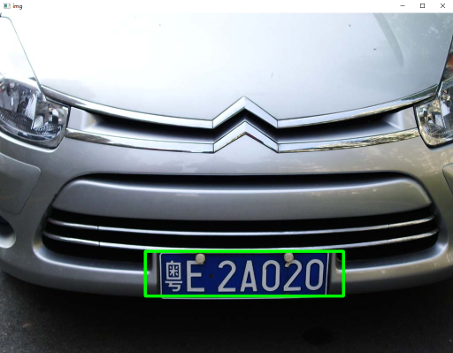
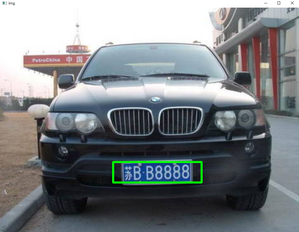
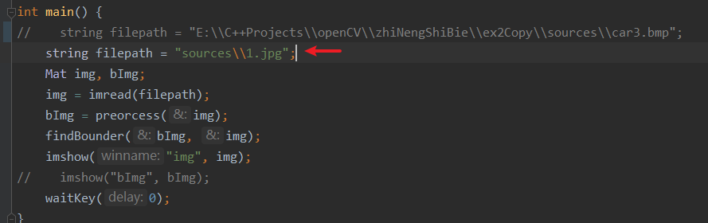

# 项目介绍

该项目为一个车牌定位项目，使用的是传统算法。利用车牌的颜色特征（蓝底白字）和形状特征（宽高比和面积），结合边缘检测，二值化（车牌和背景）及形态学操作进行车牌定位。

# 结果展示

# 如何运行
在下图红色箭头处传入车图像的文件路径，然后运行即可。

# 缺点
还不够健壮，在调参（形态学形状大小，车牌面积阈值，车牌宽高比阈值等）是基于sources文件夹里的车图像去调的，不太健壮。